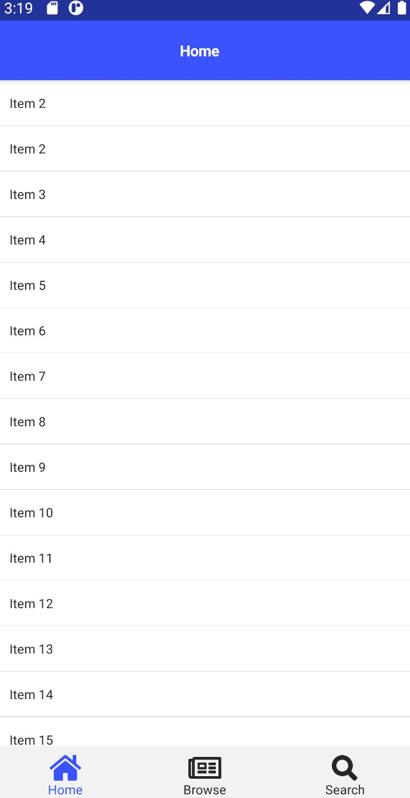

# vue_nativescript
personal environment setup note for vue with nativscript

# Result


# Environment setup

```javascript
//prerequisite environment for window
@powershell -NoProfile -ExecutionPolicy Bypass -Command "iex ((new-object net.webclient).DownloadString('https://www.nativescript.org/setup/win'))"

//init
npm i -g nativescript
tns doctor                  //check prerequisite environment
tns create projectname
    //vue.js
    //tabs    
cd projectname


//run on my smartphone
tns preview         
    //install native playground app
    //scan QR code from playground app


  ```

# Acknowledgement and References
- [vue](https://vuejs.org/)  
- [nativescript](https://nativescript.org/)  
- [template-tab-navigation-vue](https://github.com/NativeScript/nativescript-app-templates/tree/master/packages/template-tab-navigation-vue)
